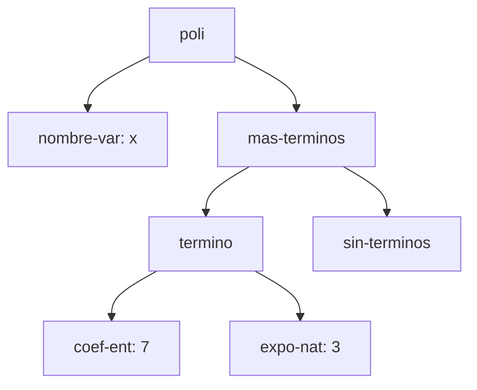
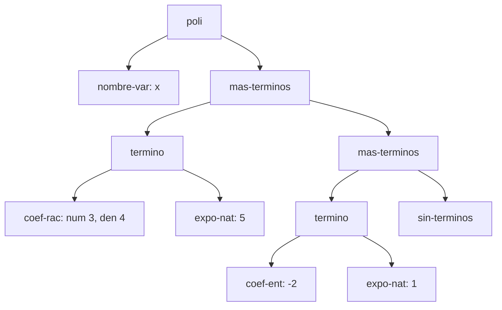
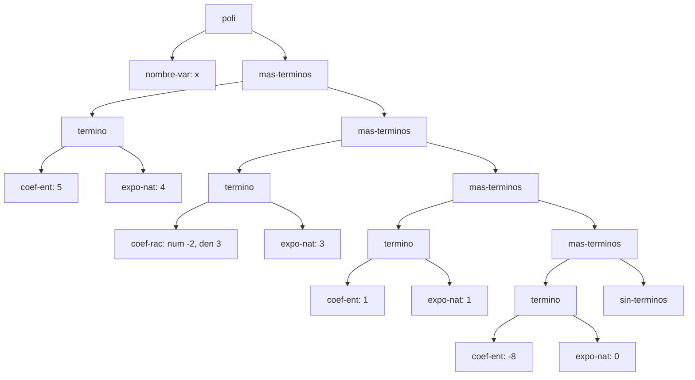
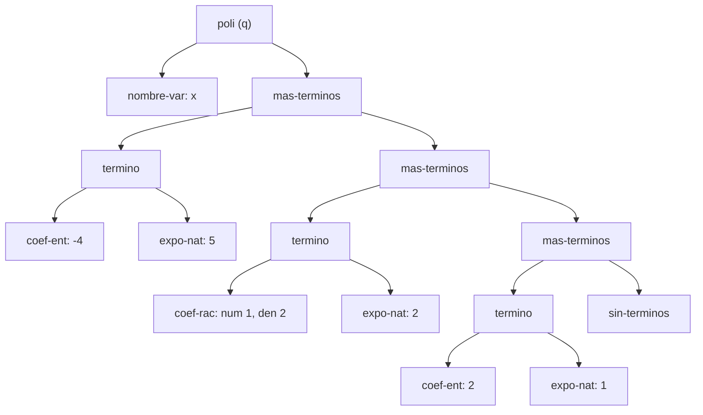
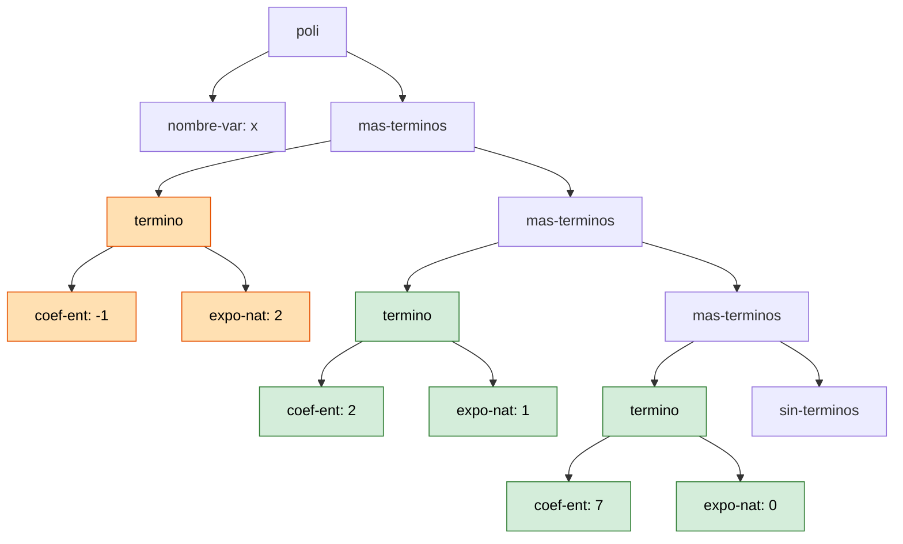

# Informe de AST — Taller 1: polinomios dispersos

**Curso:** Fundamentos de Interpretación y Compilación de Lenguajes
de Programación — Universidad del Valle, Sede Tuluá.

**Integrantes del grupo:**

| Nombre                     | Código  | Correo institucional               |
| -------------------------- | ------- | ---------------------------------- |
| Luis David Mendoza Manzano | 2067621 | mendoza.luis@correounivalle.edu.co |

---

## 1. Gramática considerada

Esta es la gramática del enunciado. Los nombres del recuadro son los
constructores que aparecen como etiquetas en los diagramas de la
sección 2.

```bnf
<polinomio>   ::= <variable> <terminos>
                   poli(var, terms)

<variable>    ::= <symbol>
                   nombre-var(s)

<terminos>    ::= '()
                   sin-terminos()
              ::= <termino> <terminos>
                   mas-terminos(term, resto)

<termino>     ::= <coeficiente> <exponente>
                   termino(coef, expo)

<coeficiente> ::= <int>
                   coef-ent(n)
              ::= <int> "/" <int>
                   coef-rac(num, den)

<exponente>   ::= <int>
                   expo-nat(k)
```

Así se realiza cada no terminal en `polinomios-datatypes.rkt` con
`define-datatype`:

| No terminal     | Tipo en el datatype | Variantes                      | Campos                                                   |
| --------------- | ------------------- | ------------------------------ | -------------------------------------------------------- |
| `<polinomio>`   | `polinomio`         | `poli`                         | `var`, `terms`                                           |
| `<variable>`    | `variable`          | `nombre-var`                   | `s`                                                      |
| `<terminos>`    | `terminos`          | `sin-terminos`, `mas-terminos` | `sin-terminos`: ninguno; `mas-terminos`: `term`, `resto` |
| `<termino>`     | `termino-tad`       | `termino`                      | `coef`, `expo`                                           |
| `<coeficiente>` | `coeficiente`       | `coef-ent`, `coef-rac`         | `coef-ent`: `n`; `coef-rac`: `num`, `den`                |
| `<exponente>`   | `exponente`         | `expo-nat`                     | `k`                                                      |

El tipo de `<termino>` se llama `termino-tad` porque `define-datatype`
no permite que el nombre del tipo coincida con el de su única variante
(`termino`).

**Cómo leer los diagramas.** Cada nodo es una variante de la gramática;
las hojas llevan el valor concreto de su campo (símbolo o entero). El
orden de los hijos de `mas-terminos` es siempre _primero el término,
después el resto de la lista_.

---

## 2. Ejemplos de AST

### Ejemplo 1 — un solo término con coeficiente entero

**Polinomio:** $p_1 = 7x^{3}$

**Construcción:**

```scheme
(poli (nombre-var 'x)
      (mas-terminos (termino (coef-ent 7) (expo-nat 3))
                    (sin-terminos)))
```

**AST:**



**Explicación:** La raíz `poli` tiene dos hijos: `nombre-var`, que
guarda la variable `x`, y la lista de términos. Esa lista es un único
`mas-terminos` cuyo primer hijo es el término $7x^3$ y cuyo segundo hijo
es `sin-terminos`, que cierra la lista (el caso base de la recursión de
la gramática: sin él el árbol quedaría incompleto). El coeficiente y el
exponente son nodos separados (`coef-ent` y `expo-nat`) porque son
categorías distintas de la gramática: un término es el par
$\langle$`<coeficiente>`, `<exponente>`$\rangle$, y el coeficiente puede
ser de dos variantes mientras que el exponente tiene una.

---

### Ejemplo 2 — dos términos, uno con coeficiente racional

**Polinomio:** $p_2 = \frac{3}{4}x^{5} - 2x$

**Construcción:**

```scheme
(poli (nombre-var 'x)
      (mas-terminos (termino (coef-rac 3 4) (expo-nat 5))
        (mas-terminos (termino (coef-ent -2) (expo-nat 1))
          (sin-terminos))))
```

**AST:**



**Explicación:** La diferencia entre `coef-rac` y `coef-ent` está en los
campos: `coef-ent` guarda un solo entero (`n`), mientras que `coef-rac`
guarda dos (`num` y `den`), porque la barra de la gramática no es un
token: el racional $\frac{3}{4}$ se almacena como numerador $3$ y
denominador $4$ por separado. El orden decreciente de exponentes que
exige el invariante se lee en el árbol de arriba hacia abajo, siguiendo
la cadena de `mas-terminos`: primero aparece el término de exponente
$5$ y, un nivel más abajo, el de exponente $1$. Si el árbol se recorre
hacia el fondo, los exponentes solo bajan y nunca se repiten.

---

### Ejemplo 3 — tres o más términos, con término independiente

**Polinomio:** $p_3 = 5x^{4} - \frac{2}{3}x^{3} + x - 8$

**Construcción:**

```scheme
(poli (nombre-var 'x)
      (mas-terminos (termino (coef-ent 5) (expo-nat 4))
        (mas-terminos (termino (coef-rac -2 3) (expo-nat 3))
          (mas-terminos (termino (coef-ent 1) (expo-nat 1))
            (mas-terminos (termino (coef-ent -8) (expo-nat 0))
              (sin-terminos))))))
```

**AST:**



**Explicación:** El término independiente $-8$ es un `termino` como
cualquier otro, con `coef-ent: -8` y exponente $0$. Su exponente sigue
siendo un nodo `expo-nat` (con $k=0$) porque la gramática no tiene
ninguna variante especial para constantes: $-8 = -8x^0$, y el
invariante lo trata igual que a los demás (exponente natural, el menor
posible, por lo que siempre va en el último `mas-terminos`, justo antes
de `sin-terminos`). Nótese que el $x$ del tercer término se almacena con
coeficiente explícito `coef-ent: 1` y exponente `expo-nat: 1`: la
representación dispersa guarda siempre el par completo.

---

### Ejemplo 4 — el resultado de `(sumar p q)`

Se usan los polinomios $p$ y $q$ del ejemplo de la Parte 3 del enunciado.

**Operandos:**

- $p = 4x^{5} - \frac{3}{2}x^{2} + 7$
- $q = -4x^{5} + \frac{1}{2}x^{2} + 2x$

AST de los operandos, para poder rastrear el origen de cada nodo del
resultado:




**Resultado:** $p + q = -x^{2} + 2x + 7$

**Construcción del resultado:**

```scheme
(poli (nombre-var 'x)
      (mas-terminos (termino (coef-ent -1) (expo-nat 2))
        (mas-terminos (termino (coef-ent 2) (expo-nat 1))
          (mas-terminos (termino (coef-ent 7) (expo-nat 0))
            (sin-terminos)))))
```

**AST del resultado.** En verde, los términos que vienen de un solo
operando (el de exponente $1$ de $q$ y el de exponente $0$ de $p$); en
naranja, el término nuevo creado al sumar dos términos del mismo
exponente. Los nodos sin color (`poli`, `nombre-var`, `mas-terminos`,
`sin-terminos`) son la estructura de lista que `sumar` reconstruye:
creo



**Origen de cada nodo.** `sumar` recorre las dos listas en paralelo
comparando los exponentes de las cabezas:

| Término del resultado                           | Viene de                                                            | Observación                                                                                                                                                                         |
| ----------------------------------------------- | ------------------------------------------------------------------- | ----------------------------------------------------------------------------------------------------------------------------------------------------------------------------------- |
| $-1\cdot x^{2}$ (`coef-ent: -1`, `expo-nat: 2`) | suma de ambos: $p$ aporta $-\frac{3}{2}$ y $q$ aporta $\frac{1}{2}$ | Nodo nuevo, creado por `sumar`: $-\frac{3}{2}+\frac{1}{2}=-1$. Los dos operandos tenían `coef-rac`, pero el resultado es entero, por lo que se construye `coef-ent` y no `coef-rac` |
| $2x$ (`coef-ent: 2`, `expo-nat: 1`)             | solo $q$                                                            | $p$ no tiene exponente $1$; el término de $q$ pasa tal cual                                                                                                                         |
| $7$ (`coef-ent: 7`, `expo-nat: 0`)              | solo $p$                                                            | Cuando $q$ se queda sin términos, lo que resta de $p$ se devuelve tal cual (en la implementación, el mismo subárbol de $p$ queda compartido)                                        |

**Términos cancelados:** el término de exponente $5$. Aparece en
ambos operandos, con coeficientes $4$ (en $p$) y $-4$ (en $q$), y
$4+(-4)=0$. El invariante exige que ningún término tenga coeficiente
cero, así que `sumar` no crea el nodo `termino` correspondiente: la
recursión continúa directamente con los restos de las dos listas. Por
eso el resultado arranca en el exponente $2$ y no en el $5$: ningún nodo
del resultado representa a $x^5$, y los tres términos que sí quedan
son los que ya estaban en $p$ o en $q$ (o su suma).

---

## 3. Referencias

- Friedman, D. P., & Wand, M. _Essentials of Programming Languages_,
  3.ª ed., MIT Press, 2008. Sección 2.1 (especificación de datos),
  sección 2.2 (representaciones de un TAD), sección 2.4
  (`define-datatype` y `cases`).
- Documentación de diagramas Mermaid en GitHub.
  <https://docs.github.com/en/get-started/writing-on-github/working-with-advanced-formatting/creating-diagrams>
